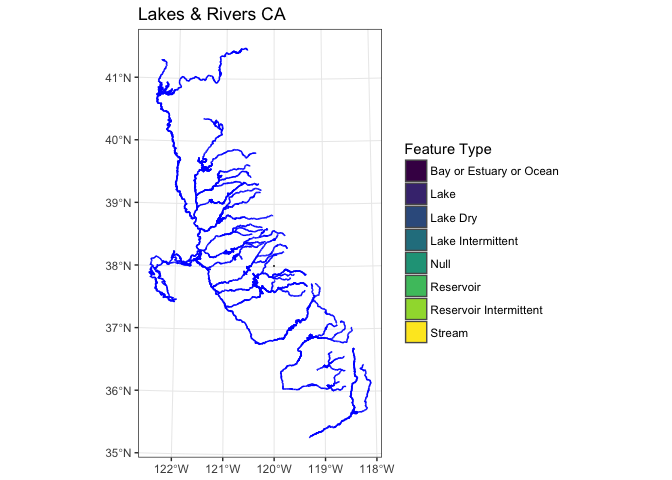
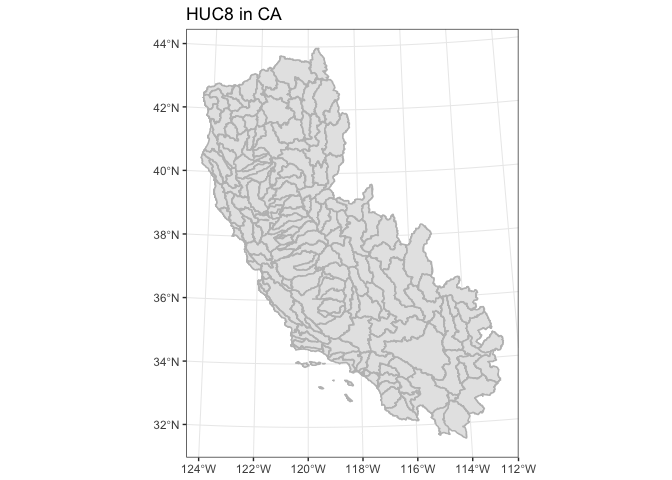
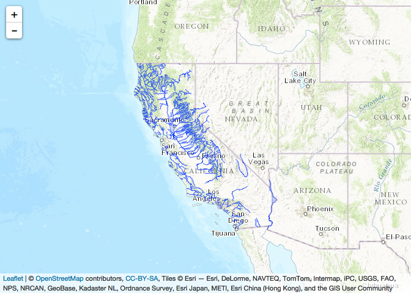
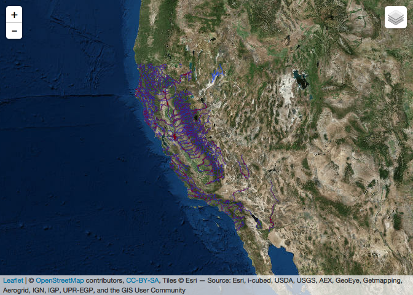
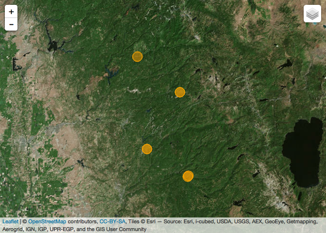

Spatial Packages
================
Ryan Peek
5/4/2017

Spatial Mapping in R
--------------------

Newer packages available (namely the `sf` package) make things much simpler and more streamlined for reading/writing and working with spatial data. A few nice writeups are [here](https://geographicdatascience.com/2017/01/06/first-impressions-from-sf-the-simple-features-r-package/) and [here](http://walkerke.github.io/2016/12/spatial-pipelines/), or [here](http://strimas.com/r/tidy-sf/). A handy CRS/spatial reference in R is [here](https://www.nceas.ucsb.edu/~frazier/RSpatialGuides/OverviewCoordinateReferenceSystems.pdf)

First we'll need a few packages for this tutorial.

``` r
#devtools::install_github("tidyverse/ggplot2")
library(ggplot2) # for dev version
library(tidyverse) # piping and general tidying
```

    ## Warning: Installed Rcpp (0.12.12) different from Rcpp used to build dplyr (0.12.11).
    ## Please reinstall dplyr to avoid random crashes or undefined behavior.

    ## Loading tidyverse: tibble
    ## Loading tidyverse: tidyr
    ## Loading tidyverse: readr
    ## Loading tidyverse: purrr
    ## Loading tidyverse: dplyr

    ## Conflicts with tidy packages ----------------------------------------------

    ## filter(): dplyr, stats
    ## lag():    dplyr, stats
    ## n():      dplyr, .env

``` r
library(sf) # rgdal/rgeos/sp replacement
```

    ## Linking to GEOS 3.6.1, GDAL 2.1.3, proj.4 4.9.3

``` r
library(viridis) #colors
```

    ## Loading required package: viridisLite

``` r
library(leaflet)
library(rgdal)
```

    ## Loading required package: sp

    ## rgdal: version: 1.2-8, (SVN revision 663)
    ##  Geospatial Data Abstraction Library extensions to R successfully loaded
    ##  Loaded GDAL runtime: GDAL 2.1.3, released 2017/20/01
    ##  Path to GDAL shared files: /usr/local/Cellar/gdal2/2.1.3_3/share/gdal
    ##  Loaded PROJ.4 runtime: Rel. 4.9.3, 15 August 2016, [PJ_VERSION: 493]
    ##  Path to PROJ.4 shared files: (autodetected)
    ##  Linking to sp version: 1.2-5

``` r
# to view codes for lots of CRS, rgdal has these options:
#EPSG <- make_EPSG()
#EPSG[grep("aea", EPSG$note, ignore.case=TRUE), 1:2]
```

### Reading in Shapes

Turns out the `sf` package is much faster and more streamlined at reading in large spatial data. This is a set of **22,676** polygons with 20 fields total (about a 530MB shapefile). It takes just over 4 seconds with `sf`.

``` r
system.time(h12_sf <- st_read("~/Dropbox/R/PROJECTS/GIS_workshop_2017/data/Western_HUC12_update_cws.shp", stringsAsFactors = F))
as.tibble(h12_sf) 
```

Provides nice header with relevant info.

    Reading layer `Western_HUC12_update_cws' from data source `/Users/ryanpeek/Dropbox/R/PROJECTS/GIS_workshop_2017/data/Western_HUC12_update_cws.shp' using driver `ESRI Shapefile'
    converted into: POLYGON
    Simple feature collection with 22676 features and 20 fields
    geometry type:  MULTIPOLYGON
    dimension:      XY
    bbox:           xmin: -386100.3 ymin: -868185.9 xmax: 1132472 ymax: 1393179
    epsg (SRID):    NA
    proj4string:    +proj=aea +lat_1=34 +lat_2=40.5 +lat_0=0 +lon_0=-120 +x_0=0 +y_0=-4000000 +datum=NAD83 +units=m +no_defs

       user  system elapsed 
      3.221   0.585   3.846

Object size is still big but smaller than `rgdal`:

-   `object.size(h12_sf)`: *`504685024 bytes`*

You can also view the data using all the `tidy/dplyr` functions:

-   `glimpse(h12_sf) # see dataframe with list-col geometry col`

<!-- -->

    Observations: 22,676
    Variables: 21
    $ HUC_8      <chr> "16060004", "16050203", "16050202", "16040107"...
    $ HUC_10     <chr> "1606000405", "1605020302", "1605020201", "160...
    $ HUC_12     <chr> "160600040503", "160502030202", "160502020103"...
    $ ACRES      <dbl> 19002, 25331, 24723, 39546, 14099, 14595, 2346...
    $ NCONTRB_A  <dbl> 0, 0, 0, 0, 0, 0, 0, 0, 0, 0, 0, 0, 0, 0, 0, 0...
    $ HU_10_GNIS <chr> NA, NA, NA, NA, NA, NA, NA, NA, NA, NA, NA, NA...
    $ HU_12_GNIS <chr> NA, NA, NA, NA, NA, NA, NA, NA, NA, NA, NA, NA...
    $ HU_10_DS   <chr> "CLOSED BAS", "1605020303", "1605020202", "160...
    $ HU_10_NAME <chr> "Rock Creek", "Bass Flat", "Town of Dayton-Car...
    $ HU_10_MOD  <chr> "NM", "NM", "NM", "GC,IT", "NM", "NM", "NM", "...
    $ HU_10_TYPE <chr> "C", "S", "S", "S", "C", "C", "S", "S", "S", "...
    $ HU_12_DS   <chr> "160600040504", "160502030306", "160502020105"...
    $ HU_12_NAME <chr> "Kingston Creek", "160502030202", "Gold Canyon...
    $ HU_12_MOD  <chr> "NM", "NM", "UA,MA,TF,DM", "GC,IT", "NM", "NM"...
    $ HU_12_TYPE <chr> "S", "S", "S", "S", "S", "S", "S", "S", "S", "...
    $ META_ID    <chr> "NV01", "NV01", "NV01", "NV01", "NV01", "NV01"...
    $ STATES     <chr> "NV", "NV", "NV", "NV", "NV", "NV", "NV", "NV"...
    $ Shape_Leng <dbl> 44626.22, 67707.48, 64078.89, 63693.45, 38386....
    $ Shape_Area <dbl> 76960949, 102545743, 100005384, 160166065, 570...
    $ HUC_6      <chr> "160600", "160502", "160502", "160401", "16050...
    $ geometry   <simple_feature> MULTIPOLYGON(((249516.13340..., MUL...

The same operation using traditional `sp::readOGR` takes a little over 16 seconds, and is a larger object in R.

``` r
library(rgdal)
dsn <- path.expand("~/Dropbox/R/PROJECTS/GIS_workshop_2017/data")
system.time(h12_sp <- readOGR(dsn = dsn, layer = "Western_HUC12_update_cws"))

object.size(h12_sp)
str(h12_sp) # lawd have mercy its S4
```

    OGR data source with driver: ESRI Shapefile 
    Source: "/Users/ryanpeek/Dropbox/R/PROJECTS/GIS_workshop_2017/data", layer: "Western_HUC12_update_cws"
    with 22676 features
    It has 20 fields

       user  system elapsed 
     13.256   2.741  16.126 

A slightly larger file size as well: - `object.size(h12_sp)`: *559701824 bytes*

And importantly, the structure of the data is in the Large `SpatialPolygonsDataFrame` format, which is a bit trickier to work with in R.

    Formal class 'SpatialPolygonsDataFrame' [package "sp"] with 5 slots
      ..@ data       :'data.frame': 22676 obs. of  20 variables:
      .. ..$ HUC_8     : Factor w/ 526 levels "15010001","15010002",..: 145 137 136 123 137 143 142 142 137 142 ...
      .. ..$ HUC_10    : Factor w/ 3913 levels "1501000101","1501000102",..: 1023 951 946 835 950 1001 993 992 952 992 ...
      .. ..$ HUC_12    : Factor w/ 20437 levels "150100010101",..: 6313 6020 6000 5495 6017 6226 6200 6195 6023 6199 ...
      .. ..$ ACRES     : num [1:22676] 19002 25331 24723 39546 14099 ...
      .. ..$ NCONTRB_A : num [1:22676] 0 0 0 0 0 0 0 0 0 0 ...
      .. ..$ HU_10_GNIS: Factor w/ 69 levels "10180 34025",..: NA NA NA NA NA NA NA NA NA NA ...
      .. ..$ HU_12_GNIS: Factor w/ 2003 levels "1001","10032 3953",..: NA NA NA NA NA NA NA NA NA NA ...
      .. ..$ HU_10_DS  : Factor w/ 1848 levels "0706010103","1206020204",..: 1846 490 488 438 1846 1846 509 508 491 508 ...
      .. ..$ HU_10_NAME: Factor w/ 3459 levels "1602030617-Frontal Bonneville Salt Flats",..: 2409 127 2893 568 865 1671 3027 759 396 759 ...
      .. ..$ HU_10_MOD : Factor w/ 674 levels "AD","AD,CD,PD",..: 567 567 567 212 567 567 567 567 567 567 ...
      .. ..$ HU_10_TYPE: Factor w/ 7 levels "C","F","I","M",..: 1 5 5 5 1 1 5 5 5 5 ...
      .. ..$ HU_12_DS  : Factor w/ 9720 levels "140102150105",..: 2954 2818 2808 2563 2814 2909 2896 2893 2818 2895 ...
      .. ..$ HU_12_NAME: Factor w/ 16667 levels "140500030714",..: 6683 257 5036 6732 10812 14678 5575 7615 258 7818 ...
      .. ..$ HU_12_MOD : Factor w/ 1091 levels "AD","AD,CD,SI,PD",..: 913 913 1088 388 913 913 388 913 913 913 ...
      .. ..$ HU_12_TYPE: Factor w/ 8 levels "C","F","I","M",..: 6 6 6 6 6 6 6 6 6 6 ...
      .. ..$ META_ID   : Factor w/ 60 levels "AZ01","AZ02",..: 32 32 32 32 32 32 32 32 32 32 ...
      .. ..$ STATES    : Factor w/ 47 levels "AZ","AZ,CA","AZ,CA,MX",..: 38 38 38 38 38 38 38 38 38 38 ...
      .. ..$ Shape_Leng: num [1:22676] 44626 67707 64079 63693 38387 ...
      .. ..$ Shape_Area: num [1:22676] 7.70e+07 1.03e+08 1.00e+08 1.60e+08 5.71e+07 ...
      .. ..$ HUC_6     : Factor w/ 72 levels "150100","150200",..: 27 25 25 22 25 27 27 27 25 27 ...
      ..@ polygons   :List of 22676
      .. ..$ :Formal class 'Polygons' [package "sp"] with 5 slots
      .. .. .. ..@ Polygons :List of 1
      .. .. .. .. ..$ :Formal class 'Polygon' [package "sp"] with 5 slots
      .. .. .. .. .. .. ..@ labpt  : num [1:2] 246070 140145
      .. .. .. .. .. .. ..@ area   : num 7.7e+07
      .. .. .. .. .. .. ..@ hole   : logi FALSE
      .. .. .. .. .. .. ..@ ringDir: int 1
      .. .. .. .. .. .. ..@ coords : num [1:1179, 1:2] 249516 249524 249538 249549 249552 ...
      .. .. .. ..@ plotOrder: int 1
      .. .. .. ..@ labpt    : num [1:2] 246070 140145
      .. .. .. ..@ ID       : chr "0"
      .. .. .. ..@ area     : num 7.7e+07
      .. ..$ :Formal class 'Polygons' [package "sp"] with 5 slots
      .. .. .. ..@ Polygons :List of 1
      .. .. .. .. ..$ :Formal class 'Polygon' [package "sp"] with 5 slots
      .. .. .. .. .. .. ..@ labpt  : num [1:2] 118003 137447
      .. .. .. .. .. .. ..@ area   : num 1.03e+08
      .. .. .. .. .. .. ..@ hole   : logi FALSE
      .. .. .. .. .. .. ..@ ringDir: int 1
      .. .. .. .. .. .. ..@ coords : num [1:4156, 1:2] 121273 121274 121276 121276 121276 ...

So for a half GB file that saves an immense amount of time, and it's a much cleaner way to work with the data.

### Looking at Bit Deeper at `sf` objects

It's possible to pull out just the list-column geometries to play with if that's something you need to do.

``` r
h12_geom <- st_read("../data/shps/HUC8_named.shp")
```

    ## Reading layer `HUC8_named' from data source `/Users/ryanpeek/Documents/github/test_projects/data/shps/HUC8_named.shp' using driver `ESRI Shapefile'
    ## Simple feature collection with 177 features and 12 fields
    ## geometry type:  MULTIPOLYGON
    ## dimension:      XY
    ## bbox:           xmin: -373986.1 ymin: -705182.2 xmax: 683177.5 ymax: 658879.7
    ## epsg (SRID):    NA
    ## proj4string:    +proj=aea +lat_1=34 +lat_2=40.5 +lat_0=0 +lon_0=-120 +x_0=0 +y_0=-4000000 +datum=NAD83 +units=m +no_defs

``` r
(h12_geom <- st_geometry(h12_geom))
```

    ## Geometry set for 177 features 
    ## geometry type:  MULTIPOLYGON
    ## dimension:      XY
    ## bbox:           xmin: -373986.1 ymin: -705182.2 xmax: 683177.5 ymax: 658879.7
    ## epsg (SRID):    NA
    ## proj4string:    +proj=aea +lat_1=34 +lat_2=40.5 +lat_0=0 +lon_0=-120 +x_0=0 +y_0=-4000000 +datum=NAD83 +units=m +no_defs
    ## First 5 geometries:

    ## MULTIPOLYGON(((51550.0018999986 403632.28030000...

    ## MULTIPOLYGON(((24021.4726000018 438583.91719999...

    ## MULTIPOLYGON(((5099.36369999871 145395.7127, 51...

    ## MULTIPOLYGON(((25300.695700001 190122.809800001...

    ## MULTIPOLYGON(((61932.503800001 268250.556299999...

``` r
attributes(h12_geom)
```

    ## $n_empty
    ## [1] 0
    ## 
    ## $crs
    ## $epsg
    ## [1] NA
    ## 
    ## $proj4string
    ## [1] "+proj=aea +lat_1=34 +lat_2=40.5 +lat_0=0 +lon_0=-120 +x_0=0 +y_0=-4000000 +datum=NAD83 +units=m +no_defs"
    ## 
    ## attr(,"class")
    ## [1] "crs"
    ## 
    ## $class
    ## [1] "sfc_MULTIPOLYGON" "sfc"             
    ## 
    ## $precision
    ## [1] 0
    ## 
    ## $bbox
    ##      xmin      ymin      xmax      ymax 
    ## -373986.1 -705182.2  683177.5  658879.7

``` r
h12_geom[[1]] %>% class
```

    ## [1] "XY"           "MULTIPOLYGON" "sfg"

### Piping to `ggplot2`

Currently need the development version of ggplot2 for this, but it's awesome.

``` r
#devtools::install_github("tidyverse/ggplot2", force=TRUE)
library(ggplot2)

rivs_sf <- st_read("../data/shps/CA_major_rivers_CV_SNMdc.shp", stringsAsFactors = F, quiet = TRUE) %>% st_transform(3310)

st_crs(rivs_sf) # check crs
```

    ## $epsg
    ## [1] 3310
    ## 
    ## $proj4string
    ## [1] "+proj=aea +lat_1=34 +lat_2=40.5 +lat_0=0 +lon_0=-120 +x_0=0 +y_0=-4000000 +ellps=GRS80 +towgs84=0,0,0,0,0,0,0 +units=m +no_defs"
    ## 
    ## attr(,"class")
    ## [1] "crs"

``` r
#"+proj=aea +lat_1=34 +lat_2=40.5 +lat_0=0 +lon_0=-120 +x_0=0 +y_0=-4000000 +datum=NAD83 +units=m +no_defs"

lakes_sf <- st_read("../data/shps/CA_major_lakes_res.shp", stringsAsFactors = T) %>% st_set_crs(3310)
```

    ## Reading layer `CA_major_lakes_res' from data source `/Users/ryanpeek/Documents/github/test_projects/data/shps/CA_major_lakes_res.shp' using driver `ESRI Shapefile'
    ## Simple feature collection with 179 features and 7 fields
    ## geometry type:  POLYGON
    ## dimension:      XY
    ## bbox:           xmin: -124.2133 ymin: 32.66598 xmax: -114.1512 ymax: 41.93167
    ## epsg (SRID):    NA
    ## proj4string:    NA

``` r
st_crs(lakes_sf)
```

    ## $epsg
    ## [1] 3310
    ## 
    ## $proj4string
    ## [1] "+proj=aea +lat_1=34 +lat_2=40.5 +lat_0=0 +lon_0=-120 +x_0=0 +y_0=-4000000 +ellps=GRS80 +towgs84=0,0,0,0,0,0,0 +units=m +no_defs"
    ## 
    ## attr(,"class")
    ## [1] "crs"

``` r
h8 <- st_read("../data/shps/HUC8_named.shp", stringsAsFactors = T) %>% st_transform(3310)
```

    ## Reading layer `HUC8_named' from data source `/Users/ryanpeek/Documents/github/test_projects/data/shps/HUC8_named.shp' using driver `ESRI Shapefile'
    ## Simple feature collection with 177 features and 12 fields
    ## geometry type:  MULTIPOLYGON
    ## dimension:      XY
    ## bbox:           xmin: -373986.1 ymin: -705182.2 xmax: 683177.5 ymax: 658879.7
    ## epsg (SRID):    NA
    ## proj4string:    +proj=aea +lat_1=34 +lat_2=40.5 +lat_0=0 +lon_0=-120 +x_0=0 +y_0=-4000000 +datum=NAD83 +units=m +no_defs

``` r
st_crs(h8)
```

    ## $epsg
    ## [1] 3310
    ## 
    ## $proj4string
    ## [1] "+proj=aea +lat_1=34 +lat_2=40.5 +lat_0=0 +lon_0=-120 +x_0=0 +y_0=-4000000 +ellps=GRS80 +towgs84=0,0,0,0,0,0,0 +units=m +no_defs"
    ## 
    ## attr(,"class")
    ## [1] "crs"

``` r
# make a plot!
ggplot() +
  geom_sf(data = lakes_sf, aes(fill = FEATURE), show.legend = T) +   scale_fill_viridis("Feature Type", discrete = T) +
  geom_sf(data=rivs_sf, color="blue") +
  ggtitle("Lakes & Rivers CA") +
  theme_bw()
```



``` r
# This takes a long time (at least a few minutes)
ggplot() +
  geom_sf(data=h8, show.legend = F, color="gray") +
  ggtitle("HUC8 in CA") +
  theme_bw()
```



### Piping to Leaflet

You can also make nice leaflet maps using this package without too much hassle.

``` r
library(leaflet)

rivers <- st_read("../data/shps/major_rivers_dissolved.shp", stringsAsFactors = F) 
```

    ## Reading layer `major_rivers_dissolved' from data source `/Users/ryanpeek/Documents/github/test_projects/data/shps/major_rivers_dissolved.shp' using driver `ESRI Shapefile'
    ## Simple feature collection with 642 features and 26 fields
    ## geometry type:  MULTILINESTRING
    ## dimension:      XY
    ## bbox:           xmin: -372136.6 ymin: -603462.5 xmax: 540081.7 ymax: 450123.9
    ## epsg (SRID):    NA
    ## proj4string:    +proj=aea +lat_1=34 +lat_2=40.5 +lat_0=0 +lon_0=-120 +x_0=0 +y_0=-4000000 +datum=NAD83 +units=m +no_defs

``` r
rivers <- st_transform(rivers, crs = 4326) # transform to WGS84
head(rivers)
```

    ## Simple feature collection with 6 features and 26 fields
    ## geometry type:  MULTILINESTRING
    ## dimension:      XY
    ## bbox:           xmin: -123.7679 ymin: 32.67473 xmax: -115.3484 ymax: 39.81825
    ## epsg (SRID):    4326
    ## proj4string:    +proj=longlat +datum=WGS84 +no_defs
    ##   HYD_FEATUR SUM_Shape_ OBJECTID_1 FNODE_ TNODE_ LPOLY_ RPOLY_ major_rive
    ## 1          0  14349.750      19173  17981  17983      0      0 14358.0927
    ## 2          1  91845.529      18620  17494  17490     -1     -1  1491.5735
    ## 3          2  28911.672       6679   6404   6384     -1     -1   582.6097
    ## 4          3   1815.001       6816   6532   6491     -1     -1  1816.9833
    ## 5          4   6996.029       6585   6313   6312     -1     -1  1231.1800
    ## 6          5   8552.818       6773   6488   6447     -1     -1  1628.7500
    ##   HYDLCA_ HYDLCA_ID MAJOR1 MINOR1 MAJOR2 MINOR2 MAJOR3 MINOR3 MAJOR4
    ## 1   19173         1      0      0      0      0      0      0      0
    ## 2   18620      3255     50    412 -99999 -99999 -99999 -99999 -99999
    ## 3    6679      3209     50    412 -99999 -99999 -99999 -99999 -99999
    ## 4    6816      4215     50    412     50    610 -99999 -99999 -99999
    ## 5    6585      3296     50    412 -99999 -99999 -99999 -99999 -99999
    ## 6    6773      4197     50    412 -99999 -99999 -99999 -99999 -99999
    ##   MINOR4 COORD_SOUR HYD_FEAT_1   FEATURE_CL COURSE_CL
    ## 1      0   100k map          0         <NA>      <NA>
    ## 2 -99999   100K DLG          1    perennial      <NA>
    ## 3 -99999   100K DLG          2    perennial      <NA>
    ## 4 -99999   100K DLG          3 intermittent      <NA>
    ## 5 -99999   100K DLG          4    perennial      <NA>
    ## 6 -99999   100K DLG          5    perennial      <NA>
    ##                                        HYDNAME FEATURE_TY Shape_Leng
    ## 1                                         <NA>       <NA> 14349.7501
    ## 2                                  Alamo River      river  1491.3395
    ## 3                                 Albion River      river   581.8751
    ## 4 Little North Fork of South Fork Albion River      river  1815.0007
    ## 5                      North Fork Albion River      river  1229.2222
    ## 6                      South Fork Albion River      river  1626.5045
    ##   Shape_Le_1                       geometry
    ## 1  14349.750 MULTILINESTRING((-122.32491...
    ## 2  91845.529 MULTILINESTRING((-115.37021...
    ## 3  28911.672 MULTILINESTRING((-123.76787...
    ## 4   1815.001 MULTILINESTRING((-123.64669...
    ## 5   6996.029 MULTILINESTRING((-123.60718...
    ## 6   8552.818 MULTILINESTRING((-123.61594...

``` r
st_proj_info("datum") # look at list of datums
```

    ##             name   ellipse
    ## 1          WGS84     WGS84
    ## 2         GGRS87     GRS80
    ## 3          NAD83     GRS80
    ## 4          NAD27    clrk66
    ## 5        potsdam    bessel
    ## 6       carthage clrk80ign
    ## 7  hermannskogel    bessel
    ## 8          ire65  mod_airy
    ## 9         nzgd49      intl
    ## 10        OSGB36      airy
    ##                                                        definition
    ## 1                                                   towgs84=0,0,0
    ## 2                                    towgs84=-199.87,74.79,246.62
    ## 3                                                   towgs84=0,0,0
    ## 4               nadgrids=@conus,@alaska,@ntv2_0.gsb,@ntv1_can.dat
    ## 5                 towgs84=598.1,73.7,418.2,0.202,0.045,-2.455,6.7
    ## 6                                        towgs84=-263.0,6.0,431.0
    ## 7         towgs84=577.326,90.129,463.919,5.137,1.474,5.297,2.4232
    ## 8      towgs84=482.530,-130.596,564.557,-1.042,-0.214,-0.631,8.15
    ## 9              towgs84=59.47,-5.04,187.44,0.47,-0.1,1.024,-4.5993
    ## 10 towgs84=446.448,-125.157,542.060,0.1502,0.2470,0.8421,-20.4894
    ##                             description
    ## 1                                      
    ## 2  Greek_Geodetic_Reference_System_1987
    ## 3             North_American_Datum_1983
    ## 4             North_American_Datum_1927
    ## 5           Potsdam Rauenberg 1950 DHDN
    ## 6                 Carthage 1934 Tunisia
    ## 7                         Hermannskogel
    ## 8                          Ireland 1965
    ## 9       New Zealand Geodetic Datum 1949
    ## 10                            Airy 1830

``` r
rivers <- rivers %>% 
  as("Spatial")

rivers %>%
  leaflet() %>%
  addTiles() %>%
  addProviderTiles("Esri.WorldTopoMap") %>%
  addPolygons(weight = 1)
```



### Databases with `sf`

This is one of the more exciting bits, you can read/write/operate directly with spatial databases.

``` r
fname <- file.path("~/Dropbox/gis/pisces.sqlite")
fname
```

    ## [1] "~/Dropbox/gis/pisces.sqlite"

``` r
# read layers in db:
st_layers(fname)
```

    ## Driver: SQLite 
    ## Available layers:
    ##               layer_name     geometry_type features fields
    ## 1           major_rivers Multi Line String    19178     23
    ## 2                  lakes     Multi Polygon     9240     12
    ## 3         HUC12FullState     Multi Polygon     5718     19
    ## 4          HUC8FullState     Multi Polygon      140     20
    ## 5            CA_Boundary     Multi Polygon        1      2
    ## 6               Counties     Multi Polygon      172     10
    ## 7        Forest_Boundary     Multi Polygon       18      5
    ## 8       Reference_Cities             Point       16     17
    ## 9 major_rivers_dissolved Multi Line String      642     26

``` r
rivs <- st_read(fname, "major_rivers")
```

    ## Reading layer `major_rivers' from data source `/Users/ryanpeek/Dropbox/gis/pisces.sqlite' using driver `SQLite'
    ## Simple feature collection with 19178 features and 23 fields
    ## geometry type:  MULTILINESTRING
    ## dimension:      XY
    ## bbox:           xmin: -372136.6 ymin: -603462.5 xmax: 540081.7 ymax: 450123.9
    ## epsg (SRID):    3310
    ## proj4string:    +proj=aea +lat_1=34 +lat_2=40.5 +lat_0=0 +lon_0=-120 +x_0=0 +y_0=-4000000 +ellps=GRS80 +towgs84=0,0,0,0,0,0,0 +units=m +no_defs

``` r
rivs <- st_transform(rivs, crs = 4326) # transform to WGS84
head(rivs)
```

    ## Simple feature collection with 6 features and 23 fields
    ## geometry type:  MULTILINESTRING
    ## dimension:      XY
    ## bbox:           xmin: -124.1975 ymin: 41.98218 xmax: -123.8642 ymax: 41.99985
    ## epsg (SRID):    4326
    ## proj4string:    +proj=longlat +datum=WGS84 +no_defs
    ##   FNODE_ TNODE_ LPOLY_ RPOLY_    LENGTH HYDLCA_ HYDLCA_ID MAJOR1 MINOR1
    ## 1      3      2     -1     -1  354.5550       1       134     50    412
    ## 2      3      1     -1     -1  449.3655       2       132     50    412
    ## 3      4      3     -1     -1  733.1945       3        74     50    412
    ## 4      6      5     -1     -1  356.8462       4        17     50    412
    ## 5      8      7     -1     -1 1827.0786       5        88     50    412
    ## 6      9      4     -1     -1 4102.3747       6        95     50    412
    ##   MAJOR2 MINOR2 MAJOR3 MINOR3 MAJOR4 MINOR4 COORD_SOURCE HYD_FEATURE_ID
    ## 1 -99999 -99999 -99999 -99999 -99999 -99999     100K DLG            268
    ## 2 -99999 -99999 -99999 -99999 -99999 -99999     100K DLG            268
    ## 3     50    610 -99999 -99999 -99999 -99999     100K DLG            268
    ## 4 -99999 -99999 -99999 -99999 -99999 -99999     100K DLG            217
    ## 5 -99999 -99999 -99999 -99999 -99999 -99999     100K DLG            286
    ## 6 -99999 -99999 -99999 -99999 -99999 -99999     100K DLG            268
    ##   FEATURE_CLASS COURSE_CL                                   HYDNAME
    ## 1     perennial                           South Fork Winchuck River
    ## 2     perennial                           South Fork Winchuck River
    ## 3  intermittent                           South Fork Winchuck River
    ## 4     perennial                              North Fork Smith River
    ## 5     perennial           Diamond North Fork North Fork Smith River
    ## 6     perennial                           South Fork Winchuck River
    ##   FEATURE_TYPE Shape_Area Shape_Length                          Shape
    ## 1        river       <NA>     353.8798 MULTILINESTRING((-124.19378...
    ## 2        river       <NA>     448.7228 MULTILINESTRING((-124.19378...
    ## 3        river       <NA>     732.6228 MULTILINESTRING((-124.18630...
    ## 4        river       <NA>     356.1493 MULTILINESTRING((-123.96911...
    ## 5        river       <NA>    1827.4988 MULTILINESTRING((-123.88526...
    ## 6        river       <NA>    4096.8672 MULTILINESTRING((-124.15290...

``` r
rivs <- rivs %>% 
  as("Spatial")

# write to a shapefile:

# st_write(rivs, "../data/shps/major_rivers_pisces.shp")
```

### More Leaflet (fancy map)

``` r
# Make a Leaflet Map

leaflet() %>%
  addTiles() %>% 
  addProviderTiles("Esri.WorldImagery", group = "ESRI Aerial") %>%
  addProviderTiles("Esri.WorldTopoMap", group = "Topo") %>%
  addPolylines(data=rivs, group="piscesRivs", weight=1) %>% 
  addPolylines(group = "BigRivs", stroke = 0.8,
               data = rivers, weight=1, color="maroon") %>% 
  
  addLayersControl(
    baseGroups = c("ESRI Aerial", "Topo"),
    overlayGroups = c("piscesRivs",
                      "BigRivs"),
    options = layersControlOptions(collapsed = T))
```



### Read in a KML/KMZ

Let's see how it does with this.

``` r
# read in a kmz of frog points

rb <- st_read("../data/RanaBoylii_RADSeq.kml")
```

    ## Reading layer `Waypoints' from data source `/Users/ryanpeek/Documents/github/test_projects/data/RanaBoylii_RADSeq.kml' using driver `LIBKML'
    ## Simple feature collection with 19 features and 11 fields
    ## geometry type:  POINT
    ## dimension:      XYZ
    ## bbox:           xmin: -120.9791 ymin: 38.98487 xmax: -120.6889 ymax: 39.51325
    ## epsg (SRID):    4326
    ## proj4string:    +proj=longlat +datum=WGS84 +no_defs

``` r
rb2 <- rb %>% as("Spatial")

#library(htmltools)

leaflet() %>%
  addTiles() %>% 
  addProviderTiles("Esri.WorldImagery", group = "ESRI Aerial") %>%
  addProviderTiles("Esri.WorldTopoMap", group = "Topo") %>%
  addCircleMarkers(data=rb, group="RABO", weight=1, color = "orange", opacity = 0.7, labelOptions= labelOptions(noHide = F,
      style = list(
        "color" = "black",
        "font-family" = "serif",
        "font-style" = "italic",
        "box-shadow" = "3px 3px rgba(0,0,0,0.25)",
        "font-size" = "12px",
        "border-color" = "rgba(0,0,0,0.5)"
      )),
      label = paste0("FieldID: ", rb$Name,
                     "Description: ", rb$Description)) %>%

  addLayersControl(
    baseGroups = c("ESRI Aerial", "Topo"),
    overlayGroups = c("RABO"),
    options = layersControlOptions(collapsed = T))
```


